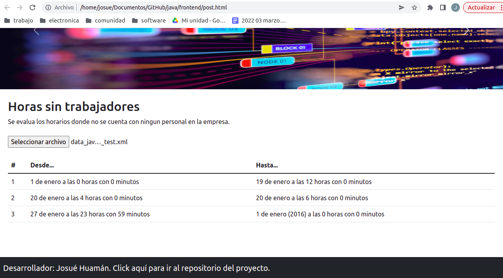

# proyecto
Determinar con java los intervalos de tiempo donde no hay personal trabajando. El programa debe ser capaz de hacer este calculo en el rango enero 2015 hasta diciembre 2015.
# entreble

Despues de ejecutar el programa se llevo a la siguiente conclusion:


# datos
- cliente: IPTP network
- desarrollador: Josue Huaman
# arquitectura del proyecto

```
                +--------+                  +--------+       
                |        |                  |        |       
xml file -->    |frontend|  API (json) -->  |backend |       
                |        |  <-- API (json)  |        |       
                +--------+                  +--------+      
                  fetch                  spring controller 
```
- frontend: 
  - lenguge: Javascrit
  - framework: bootstrap
- backend: 
  - framwork: Sring
  - lenguaje de programacion: java
  - patrones de diseño: facade y proxy

## lexico
- rango: es el espacio de tiempo donde SI hay alguien trabajando.
- intervalo: es el espacio de tiempo donde NO hay nadie trabajando.
- espacio de tiempo: se define como unn objeto de la clase Intervalo

PD: aqui habra una confucion por los terminos. Corregir de la siguiente manera:
- rango -> inter_si_trab
- intervalo -> inter_no_trab
- Intervalo -> Intervalo
## logica del backend
Al inicio se tendra un solo intervalo. Al ingresar los rangos de horarios se iran dividiendo, acortando o eliminando segun sea el caso:
```bash
i = punto inferior del rango
s = punto superior del rango
a = punto inferior del intervalo
b = punto superior del intervalo
caso 1
               i      s
               |======|                    rango de hora ingresado
        a                      b
        *----------------------*           intervalo
        *------*      *--------*           resultado
caso 2
    i      s
    |======|                               rango de hora ingresado
        a                      b
        *----------------------*           intervalo
           *-------------------*           resultado
caso 3
                            i      s
                            |======|       rango de hora ingresado
        a                      b
        *----------------------*           intervalo
        *-------------------*              resultado
caso 4
    i                              s
    |==============================|       rango de hora ingresado
        a                      b
        *----------------------*           intervalo
                                           resultado
caso 5
                                 i      s
                                 |======|  rango de hora ingresado
        a                      b
        *----------------------*           intervalo
        *----------------------*           resultado
caso 6
i      s
|======|                                   rango de hora ingresado
        a                      b
        *----------------------*           intervalo
        *----------------------*           resultado
```
| | i dentro de intervalo | s dentro de intervalo | ni i ni s dentro de intervalo | intervalo
| - | - | - | - | - |
| caso 1 | si | si | x | se divide
| caso 2 | no | si | x | se acorta (por la izquierda)
| caso 3 | si | no | x | se acorta (por la derecha)
| caso 4 | no | no | i < a && b < s | se elimina (uno menor y otro mayor)
| caso 5 | no | no | b < i | no se toca (ambos mayores)
| caso 6 | no | no | s < a | no se toca (ambos menores)


# logica de fecha
minutos por hora, dia y mes:
- 1 hora = 60 minutos
- 1 dia = 24 horas = 24 x 60 minutos
- 1 mes = y dias = y x 24 x 60 minutos

dias de los meses del 2015:
- 31 enero
- 28 febrero
- 31 marzo
- 30 abril
- 31 mayo
- 30 junio
- 31 julio
- 31 agosto
- 30 septiembre
- 31 octubre
- 30 noviembre
- 31 diciembre
-------
total: 365 dias
# estructura
```
|-- frontend (frontend :D)
|-- README.md (documentacion)
|-- data_java-2.xml (XML de la empresa)
|-- payroll (backend - spring bot)
    |-- pom.xml (dependencias del proyecto)
    |-- src
        |-- main
            |-- java
                |-- payroll
                    |-- Fecha.java (clase propia para la logica)
                    |-- Logica.java (clase propia para la logica)
                    |-- Intervalo.java (clase propia para la logica)
                    |-- Facade.java (clase propia para la logica)
                    |-- MiTest.java (clase propia para la logica)
```

# deploy 
- descargar repo git hub y ejecutar los siguientes comandos
```bash
cd (ubicacion)/java/payroll
./mvnw spring-boot:run
```

# links
## java
top programming language 2022 [link](https://statisticsanddata.org/data/the-most-popular-programming-languages-1965-2022-new-update/#:~:text=As%20of%201%20January%202022,from%20third%20position%20to%20first.)

## refencia oficial
- Spring [link](https://spring.io/)
- Maven [link](https://maven.apache.org/)

## teoria
- final vs abstract [link](https://www.google.com/search?q=final+abstract+java&tbm=isch&ved=2ahUKEwj2yd_Kxd_2AhW6LLkGHbmKBYMQ2-cCegQIABAA&oq=final+abstract+java&gs_lcp=CgNpbWcQAzoHCCMQ7wMQJ1CEBli2DWCaD2gCcAB4AIABugGIAeAEkgEDMC40mAEAoAEBqgELZ3dzLXdpei1pbWfAAQE&sclient=img&ei=uc48YraJBrrZ5OUPuZWWmAg&bih=575&biw=1294#imgrc=vcpN2vkTsVy5XM)
- private vs default vs protected vs public [link](https://i.stack.imgur.com/JqGNs.png)
- entity [link](https://docs.oracle.com/javaee/6/tutorial/doc/bnbqa.html)
- arquitectura de spring boot (no oficial) [link](https://www.researchgate.net/figure/Fig-2-Architecture-flow-of-spring-boot-Applications-Spring-boot-uses-all-the-features_fig2_341151097)
- arquitectura spring + react [link](https://www.youtube.com/watch?v=LCT4LPm5dnI)

