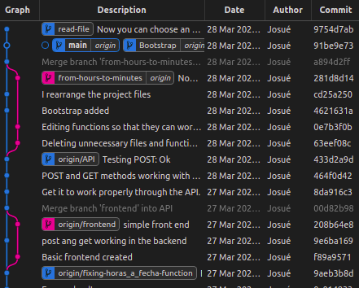

# Proyecto
Hacer un programa usando el lenguaje __Java__ que determine los intervalos de tiempo (__mes, dia hora y minutos__) donde no hay personal trabajando en la empresa IPTP. El programa debe ser capaz de hacer este calculo en el rango enero 2015 hasta diciembre 2015.
# Entregable

Despues de ejecutar el programa y considerando que el algoritmo hace la evaluacion en el todo el año 2015, se llevo a la siguiente conclusion:


No hay personal trabajando desde:
```
- el primero de enero a las 0:00 horas hasta el 19 de enero al medio dia en punto.
- el 20 de enero a las 4:00 horas hasta el 20 de enero a las 6:00 horas.
- el 27 de enero a las 23:59 horas hasta el 1 de enero a las 0:00 del 2016.
```

# Datos
generales:
- __cliente__: IPTP network
- __desarrollador__: Josué Huamán
- __fecha inicio__: 25 de marzo a las 11:48 minutos
- __fecha fin__: 28 de marzo a las 23:59 minutos
- __lenguage solicitado__: Java

tecnicos:
- __sistema operativo__: Ubuntu Linux
- __lenguaje__: java
- __framework__: spring y bootstrap
- __herramientas__: Visual studio code, thunder client, spring initalizer, crhome developer tool, git, etc.



# Arquitectura del proyecto

```
                +--------+                  +--------+       
                |        |                  |        |       
xml file -->    |frontend|  API (json) -->  |backend |       
                |        |  <-- API (json)  |        |       
                +--------+                  +--------+      
                  fetch                  spring controller 
```
- backend: 
  - __lenguaje de programacion__: Java
  - __framwork__: Spring-boot (JPA, Web app)
  - __patrones de diseño__: Facade y Adapter (GoF)
- frontend: 
  - __lenguge__: Javascript
  - __framework__: Bootstrap (framwork de CSS)

## palabras claves...
- __rango__: es el espacio de tiempo donde SI hay alguien trabajando.
- __intervalo__: es el espacio de tiempo donde NO hay nadie trabajando.
- __espacio de tiempo__: se define como unn objeto de la clase Intervalo
## logica del backend
Al inicio se tendra un solo intervalo. Al ingresar los rangos de horarios se iran dividiendo, acortando o eliminando segun sea el caso:
```bash
i = punto inferior del rango
s = punto superior del rango
a = punto inferior del intervalo
b = punto superior del intervalo
caso 1
               i      s
               |======|                    rango de hora ingresado
        a                      b
        *----------------------*           intervalo
        *------*      *--------*           resultado
caso 2
    i      s
    |======|                               rango de hora ingresado
        a                      b
        *----------------------*           intervalo
           *-------------------*           resultado
caso 3
                            i      s
                            |======|       rango de hora ingresado
        a                      b
        *----------------------*           intervalo
        *-------------------*              resultado
caso 4
    i                              s
    |==============================|       rango de hora ingresado
        a                      b
        *----------------------*           intervalo
                                           resultado
caso 5
                                 i      s
                                 |======|  rango de hora ingresado
        a                      b
        *----------------------*           intervalo
        *----------------------*           resultado
caso 6
i      s
|======|                                   rango de hora ingresado
        a                      b
        *----------------------*           intervalo
        *----------------------*           resultado
```
| | i dentro de intervalo | s dentro de intervalo | ni i ni s dentro de intervalo | intervalo
| - | - | - | - | - |
| caso 1 | si | si | x | se divide
| caso 2 | no | si | x | se acorta (por la izquierda)
| caso 3 | si | no | x | se acorta (por la derecha)
| caso 4 | no | no | i < a && b < s | se elimina (uno menor y otro mayor)
| caso 5 | no | no | b < i | no se toca (ambos mayores)
| caso 6 | no | no | s < a | no se toca (ambos menores)


## logica de fecha
El dato que recibimos son minutos. Estos tenemos que convertirlos a fecha. Para ello consideramos que los dias varian segun el mes:

dias de los meses del 2015:
- 31 enero
- 28 febrero
- 31 marzo
- 30 abril
- 31 mayo
- 30 junio
- 31 julio
- 31 agosto
- 30 septiembre
- 31 octubre
- 30 noviembre
- 31 diciembre

Con esto claro, queda calcular a partir de los minutos cuandos meses, dias y horas han pasado.
# Estructura del repositorio
Dentro de la carpeta _/main/java/payroll_ se encuentra las clases de Java que hacen la logica del ejercicio.
```
|-- frontend (frontend :D)
|-- README.md (documentacion)
|-- input (carpeta con el XML de la empresa)
|-- payroll (backend - spring bot)
    |-- pom.xml (dependencias del proyecto)
    |-- src
        |-- main
            |-- java
                |-- payroll
                    |-- Fecha.java (clase propia para la logica)
                    |-- Logica.java (clase propia para la logica)
                    |-- Intervalo.java (clase propia para la logica)
                    |-- Facade.java (clase propia para la logica)
                    |-- MiTest.java (clase propia para la logica)
```
# Deploy
descargar este repositorio y ejecutar los siguientes comandos (Ubuntu):
```bash
cd (ubicacion del repositorio)/java/payroll
./mvnw spring-boot:run
```
Con esto se instalaran las dependencias del backend y se levantara el puerto 8080 para que el frontend pueda consumir de el. Luego ir a la carpeta: 
```bash
cd (ubicacion del repositorio)/java/frontend
```
dar doble click al archivo _post.html_ y se abrira la pagina con el aplicativo desarrollado. Dar click donde dice _Seleccionar archivo_. Ir a la carpeta _input_ y seleccionar el archivo _data_java-2.xml_. Este fue el archivo que nos dio la empresa. En la parte inferior se verán los rangos donde no hay personal trabajando.
# links
## java
top programming language 2022 [link](https://statisticsanddata.org/data/the-most-popular-programming-languages-1965-2022-new-update/#:~:text=As%20of%201%20January%202022,from%20third%20position%20to%20first.)

## refencia oficial
- Spring [link](https://spring.io/)
- Maven [link](https://maven.apache.org/)

## teoria
- final vs abstract [link](https://www.google.com/search?q=final+abstract+java&tbm=isch&ved=2ahUKEwj2yd_Kxd_2AhW6LLkGHbmKBYMQ2-cCegQIABAA&oq=final+abstract+java&gs_lcp=CgNpbWcQAzoHCCMQ7wMQJ1CEBli2DWCaD2gCcAB4AIABugGIAeAEkgEDMC40mAEAoAEBqgELZ3dzLXdpei1pbWfAAQE&sclient=img&ei=uc48YraJBrrZ5OUPuZWWmAg&bih=575&biw=1294#imgrc=vcpN2vkTsVy5XM)
- private vs default vs protected vs public [link](https://i.stack.imgur.com/JqGNs.png)
- entity [link](https://docs.oracle.com/javaee/6/tutorial/doc/bnbqa.html)
- arquitectura de spring boot (no oficial) [link](https://www.researchgate.net/figure/Fig-2-Architecture-flow-of-spring-boot-Applications-Spring-boot-uses-all-the-features_fig2_341151097)
- arquitectura spring + react [link](https://www.youtube.com/watch?v=LCT4LPm5dnI)

